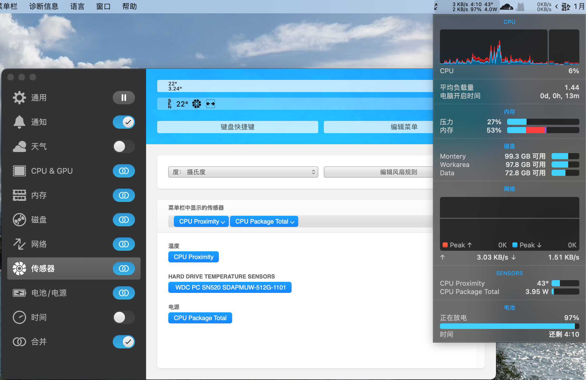
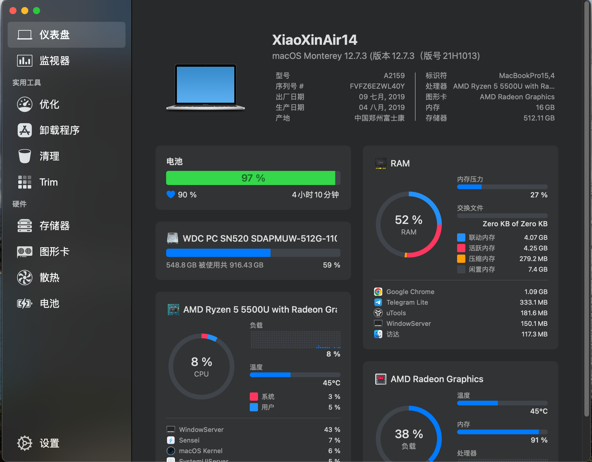
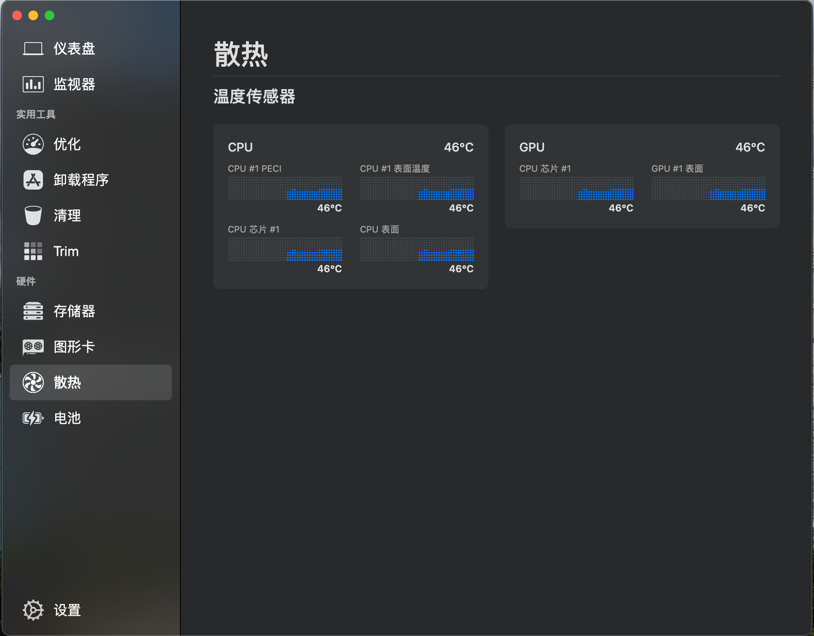

SMCAMDProcessor
========

原版[README.md](https://github.com/htmambo/SMCAMDProcessor/blob/master/README_EN.md)  

# 说明
这是我基于[trulyspinach/SMCAMDProcessor](https://github.com/trulyspinach/SMCAMDProcessor)的一些修改，所有代码均来自于网络搬运，目前实现了：  
1. 修复0.7.x后在`iStat Menus`中显示CPU温度；  
2. 添加CPU功耗、GPU温度的SMCKey输出；  
3. 开机自动关闭CPB；  
4. 睡眠唤醒后恢复睡睡眠前的CPB状态。  

# 截图

## 注意事项
* 我对macOS内核开发`一窍不通`，针对这个软件项目的修改也仅仅只是因为`喜欢折腾`而已。

* 本人不承担您因为使用此软件所造成的一切损失！

