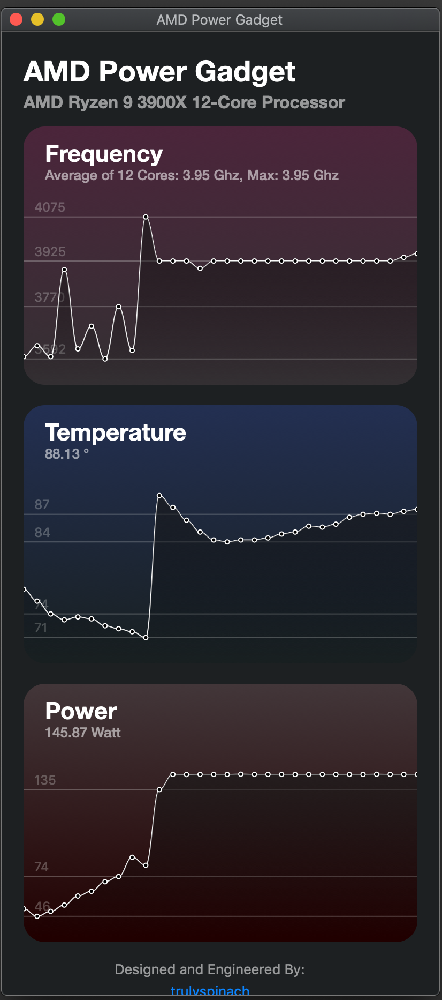

SMCAMDProcessor
========

AMD Processor power management plugin for [VirtualSMC](https://github.com/acidanthera/VirtualSMC).

Please note that this release is at very initial stage of development, make sure you have a proper backup of your EFI folder and never run on any system that matters. 

### Now introducing "AMD Power Gadget". Just like the Intel one!

## Features
* Supports for reading of temperature, energy and clock data on AMD 17h Processors.

## Tested Processors
* Ryzen 9 3900X
* Ryzen 7 3700X
* Ryzen 5 3600

## Notes
* I am still fairly new to macOS kernel development, this software project was initally a hobby project to get some reading on my newly built AMD hackintosh computer.

* With that being said, please bear with some of the spaghetti and not-idiomatic codes. Any criticism is much welcomed :)

* I'm having a hard time figuring out the combinations of SMC keys required for iStat to display a type of sensor. So some sensors might not be available based on your SMBios type.
