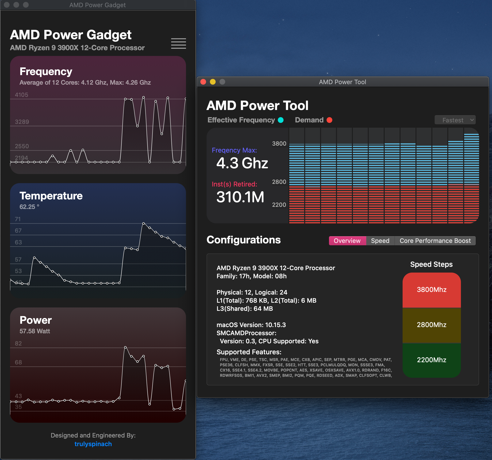
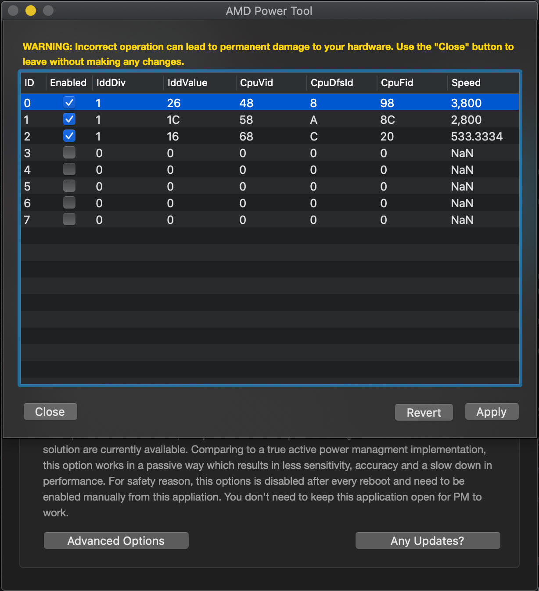
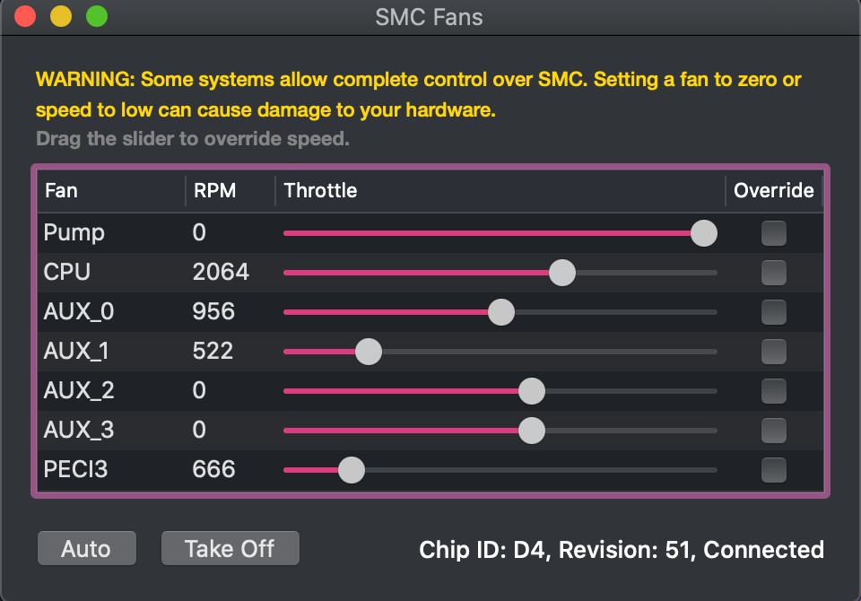
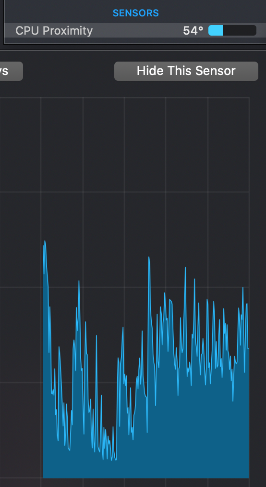

SMCAMDProcessor
========

XNU kernel extension for power management and monitoring of AMD processors.
Also comes with a plugin for [VirtualSMC](https://github.com/acidanthera/VirtualSMC) to export readings to other applications.

~~Please note that this release is at very initial stage of development, make sure you have a proper backup of your EFI folder and never run on any system that matters.~~
This notice has been here since the very beginning of this repository. Although I still wouldn't consider it completely finished, many users, including me, have been running these kexts daily without any major issues. If it's your first time adding these kexts to your system, please ensure you have a backup of your EFI.

Now you can also access the latest(and probably unstable) builds from [Github Action](https://github.com/trulyspinach/SMCAMDProcessor/actions).

## Installation

SMCAMDProcessor now comes in two separate binaries(kernel extensions):
* `AMDRyzenCPUPowerManagement.kext` for all power management features. This kext is also required if you would like to use **AMD Power Gadget**.
* `SMCAMDProcessor.kext` to publish readings to [VirtualSMC](https://github.com/acidanthera/VirtualSMC), which enables macOS applications like iStat to display sensor data. This kext depends on `AMDRyzenCPUPowerManagement.kext` to collect sensor data, thus must be loaded after.

1. Download the kext(s) and application from [Release](https://github.com/trulyspinach/SMCAMDProcessor/releases) page.
   * Optionally, you can instead download the latest(probably unstable) build from [Github Action](https://github.com/trulyspinach/SMCAMDProcessor/actions).
3. Add `AMDRyzenCPUPowerManagement.kext` to kext folder of your bootloader.
4. Edit your bootloader's config file to make sure the kext is enabled.
5. If you're using [VirtualSMC](https://github.com/acidanthera/VirtualSMC) you can also load `SMCAMDProcessor.kext` to publish sensor data.
6. Bootloaders like `OpenCore` will link each kext in the order they present in config file, so make sure `AMDRyzenCPUPowerManagement.kext` comes before `SMCAMDProcessor.kext` as it serves as a dependency.

## Features
* CPU power management for AMD Zen processors. 
* Supports for reading of temperature, energy and frequency data on AMD Zen Processors.
* Manual switching of processor speed.
* PState editing.

## AMD Power Gadget

## Editing PState

Since the release 0.3.1, you can now edit your CPU PState using AMD Power Tool.

To access PState editor:
1. Open AMD Power Tool
2. Go to 'Speed' tab
3. Click 'Advanced Options'

## Fan Control

Due to the amount of request an experimental feature for reading and overriding fan speed is out!

You can access this menu from menu bar "Open -> SMC Fans" or the button in Power Tool.
Currently only a limited amount of SMC controllers are supported.

#### Safety Notes
* Incorrect PState setting can potentially cause permanent damage to your computer hardware.
* For safety concern, this function was limited to root user only. You can either launch AMD Power Gadget with root user or use `-amdpnopchk` to disable this check.

## Contribution
#### If you like this project, please consider supporting it via:

* Give it a star!
* [Buy](https://ko-fi.com/trulyspinach) me a coffee.

* Opening up an issue if you encountered any problem or want to make suggestions.
* or if you're a coding person, feel free to submit any pull request or just DM me on Discord.

## Credits
* [aluveitie](https://github.com/aluveitie) for various enhancements and fixes.
* [mauricelos](https://github.com/mauricelos) for IT86XXE SMC chip driver.
* [necross2](https://github.com/necross2) for adding support to temperature sensor offset.
* [Shaneee](https://github.com/Shaneee) for the beautiful icon.

## Notes
* I am still fairly new to macOS kernel development, this software project was initally a hobby project, **and it still is**, to get some reading on my newly built AMD hackintosh computer.

* With that being said, please bear with some of the spaghetti and not-idiomatic codes. Any criticism is much welcomed :)

